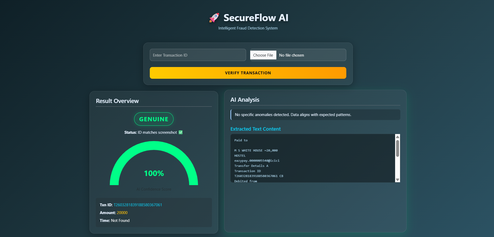

# SecureFlow AI – Fraud Detection System  
### OCR + Machine Learning Based Transaction Analysis  

---

## Project Preview  


---

## Overview  
SecureFlow AI is an intelligent fraud detection system that analyzes transaction details and predicts whether a transaction is **Safe, Suspicious, or Fraudulent**.  

---

## Key Features  
- ✨ Fraud Risk Detection  
- 📊 Risk Score Calculation  
- 🖥️ User-Friendly Interface  
- 📄 Includes Project Report  

---

## Tech Stack  
- Python (Flask)  
- HTML, CSS  
- Rule-Based Logic  

---

## Project Structure  
```
Fraud-Detection/
│── app.py
│── requirements.txt
│── transactions.db
│── report.pdf
│── temp.png
│
├── templates/
│     ├── index.html
│     └── dashboard.html
```

---

## How It Works  
- User enters transaction details  
- System evaluates risk factors  
- Displays fraud prediction result  

---

## Run Project  
```
pip install -r requirements.txt  
python app.py  
```

Open in browser:  
http://127.0.0.1:5000  

---

## Author  
Rohan Kumar  
Roll No: 2410250039

---

## Future Scope  
- Real ML Model Integration  
- Advanced OCR Processing  
- Live Transaction Monitoring  
